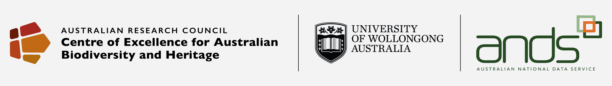

==============================
OCTOPUS database documentation
==============================

**OCTOPUS** (`https://octopusdata.org <https://octopusdata.org>`_) is an Open Geospatial Consortium (OGC) compliant web-enabled database that allows users to visualise, query, and download cosmogenic Be-10 and Al-26, luminescence, and radiocarbon ages and denudation rates associated with erosional landscapes, Quaternary depositional landforms and archaeological records, along with associated geospatial (vector and raster) data layers.

OCTOPUS is non-commercial, non-profit, and least restrictively licensed with its main purpose being the sustainment, upcycling and public provisioning of valuable legacy data that would otherwise be lost to the research community. Beyond research, the promotion and implementation of Indigenous self-management, public training and education are declared OCTOPUS focus target scopes.

.. The latest OCTOPUS database documentation is available 

.. * ``online`` (https://octopus-database.readthedocs.io/en/latest/),
.. * as ``PDF`` (https://octopus-database.readthedocs.io/_/downloads/en/latest/pdf/), 
.. * as ``HTMLZip`` (https://octopus-database.readthedocs.io/_/downloads/en/latest/htmlzip/),
.. * or as ``Epub`` (https://octopus-database.readthedocs.io/_/downloads/en/latest/epub/).

.. important::

   | This documentation [#]_ refers to the latest version of the OCTOPUS database. This can be accessed via the OCTOPUS web interface (https://octopusdata.org), or via the `Web Feature Services (WFS) <http://geoserver.octopusdata.org/geoserver/ows?service=wfs&version=2.0.0&request=GetCapabilities>`_ running on the OCTOPUS GeoServer. Past versions of the OCTOPUS data collections have been archived on the Zenodo web repository to comply with DOI (Digital Object Identifier) requirements.
   |
   | |:warning:| **Past versions of data collections are deprecated and we explicitly do not recommend using these!**

.. toctree::
   :hidden:
   :maxdepth: 2

   intro
   collections
   data_tables
   output_tables
   parent_tables
   usage
   references
   resources
   about

| **Acknowledgements**
| The OCTOPUS database is supported by the Australian Research Council Centre of Excellence for Australian Biodiversity and Heritage (CABAH) [#]_. Funding was also provided by the University of Wollongong [#]_ and the Australian National Data Service (ANDS), now part of the Australian Research Data Commons [#]_.
|
| Selection and composition of attribute fields for the individual sub-collections is the collective effort of expert panels, whose contributing individuals are named in the :ref:`Data collections` section. Shaping and maintaining OCTOPUS v.2 benefited from the liberal knowledge transfer and advice of Jessica Blois, Simon Goring, Eric C. Grimm, and John W. (Jack) Williams (in alphabetic order). Finally, we thank Richard G. Roberts, Julie Matarczyk, and Nathan Wright for discussions and their support of the OCTOPUS project.
|
| We acknowledge the Traditional Custodians of the lands on which we have worked as well as their continued spiritual and cultural connection to Country.

.. rubric:: Footnotes

.. [#] For the best user experience, we recommend the usage of Google Chrome or Firefox browsers.
.. [#] `https://epicaustralia.org.au <https://epicaustralia.org.au>`_
.. [#] `https://www.uow.edu.au <https://www.uow.edu.au>`_
.. [#] `https://ardc.edu.au <https://ardc.edu.au>`_
