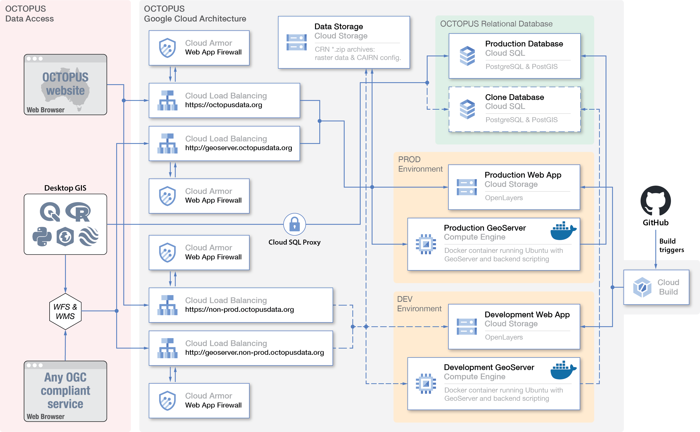

============
Introduction
============

Cosmogenic radionuclide (CRN) exposure dating (`Granger et al., 2013 <https://doi.org/10.1130/B30774.1>`_; `Schaefer et al., 2022 <https://doi.org/10.1038/s43586-022-00096-9>`_), luminescence dating (`Rhodes, 2011 <https://doi.org/10.1146/annurev-earth-040610-133425>`_; `Murray et al., 2021 <https://doi.org/10.1038/s43586-021-00068-5>`_), and radiocarbon dating (`Hajdas et al., 2021 <https://doi.org/10.1038/s43586-021-00058-7>`_) are geochronological techniques that are the most widely applicable to the recent geological past. All three of the techniques allow determination of the deposition age of sediments and associated materials, and cosmogenic radionuclides can also be used to quantify the rate at which landforms or landscapes are lowered by physical and chemical erosion processes. The three techniques have made important contributions to the reconstruction of past environments (`Roberts et al., 2001 <https://doi.org/10.1126/science.1060264>`_; `Singhvi and Porat, 2008 <https://doi.org/10.1111/j.1502-3885.2008.00058.x>`_; `Balco, 2019 <https://doi.org/10.1146/annurev-earth-081619-052609>`_; `Hocknull et al., 2020 <https://doi.org/10.1038/s41467-020-15785-w>`_), and CRN and luminescence dating have revolutionised the field of quantitative geomorphology (`Granger and Schaller, 2014 <https://doi.org/10.2113/gselements.10.5.369>`_; `Dixon and Riebe, 2014 <https://doi.org/10.2113/gselements.10.5.363>`_; `Guralnik et al., 2015 <https://doi.org/10.1016/j.quageo.2014.09.001>`_; `King et al., 2016 <https://doi.org/10.1016/j.quageo.2016.01.004>`_). Radiocarbon dating, luminescence dating, and (to some extent) CRN exposure dating have also made substantial contributions to archaeology (`Akcar et al., 2008 <https://doi.org/10.3285/eg.57.1-2.9>`_; Renfrew, 2011; `Roberts et al., 2015 <https://doi.org/10.1016/j.jas.2015.02.028>`_), including to the debates on the timing of human evolution and migration (`Granger et al., 2015 <https://doi.org/10.1038/nature14268>`_; `Clarkson et al., 2017 <https://doi.org/10.1038/nature22968>`_; `Jacobs et al., 2019 <https://doi.org/10.1038/s41586-018-0843-2>`_; `Zilhão et al., 2020 <https://doi.org/10.1126/science.aaz7943>`_; `Crabtree et al., 2021 <https://doi.org/10.1038/s41562-021-01106-8>`_).

Like most geochronological techniques, the three dating techniques require specialised training, laboratories, and equipment, and they involve lengthy and costly sample preparation procedures. As a result, studies relying on CRN, luminescence, or radiocarbon techniques will often produce relatively small datasets (n<100) that address very specific research questions and focus on relatively small study areas. Furthermore, the lack of formal reporting standards (`Schaefer et al., 2022 <https://doi.org/10.1038/s43586-022-00096-9>`_; `Murray et al., 2021 <https://doi.org/10.1038/s43586-021-00068-5>`_; `Hajdas et al., 2021 <https://doi.org/10.1038/s43586-021-00058-7>`_) coupled with the disconnect that exists in some cases between the researchers collecting the samples and interpreting the ages and/or rates and the researchers preparing the samples and undertaking the measurements means that the techniques often produce datasets that are unmanaged. These datasets may become forgotten once the study has been completed and results are published, and they may not include sufficient levels of supporting information for the quality of the raw data to be easily determined or for the raw data to be reusable with confidence -- for example, in instances where data need to be recalculated due to updated measurement standards and/or data reduction protocols. The above limitations mean that carefully curated compilations of CRN, luminescence, and radiocarbon data are necessary to allow for larger-scale synoptic studies and instances where the quality rating of ages/denudation rates is desirable; moreover, carefully curated compilations of these data are critical to ensuring the longevity and value of often irreplaceable legacy data.

Here, we describe the upgraded and updated version of the database -- OCTOPUS v.2. The application part of the database has been extensively rewritten, and it is now running on the Google Cloud Platform (https://cloud.google.com, last access: 4 May 2023). The data are stored in a relational database, and the data collections have been extended to include a global collection of CRN exposure ages on glacial landforms; an Australian collection of OSL and TL ages from aeolian and lacustrine sedimentary archives; OSL, TL, and radiocarbon ages from Sahul (Australia, New Guinea, and the Aru Islands joined by lower sea levels) archaeological records; and a collection of late-Quaternary records of non-human vertebrate fauna fossil ages from Sahul. Supporting data are comprehensive and include bibliographic, contextual, and sample-preparation- and measurement-related information. In the case of fluvial sediment CRN data, the database also includes all necessary information and input files for the recalculation of denudation rates using CAIRN, an open-source program for calculating basin-wide denudation rates from 10Be and 26Al data (`Mudd et al., 2016 <https://doi.org/10.5194/esurf-4-655-2016>`_). Further, all CRN data have been recalculated and harmonised using the same program. OCTOPUS v.2 can be accessed at https://octopusdata.org (last access: 4 May 2023).

.. note::

   The above section is a modified version of Section 1 from `Codilean et al. 2022 <https://doi.org/10.5194/essd-14-3695-2022>`_

System architecture
-------------------

The software architecture behind OCTOPUS v.2 is illustrated in Fig. Sys1. Both software and data are deployed on the Google Cloud Platform (GCP) and follow a modular set-up aimed at optimal leveraging of cloud services available within the GCP. Although migration of the OCTOPUS platform to a cloud-hosted infrastructure such as the GCP adds complexity to the system architecture, Google Cloud offers extensive infrastructure and software solutions which are constantly updated with the latest technologies and architectures. This constant evolution ensures that any future work and redesigns of the OCTOPUS platform have access to best-in-class solutions. Further, the OCTOPUS platform is completely reproducible with access to a GCP environment, as the source code contains the entire project and required documentation, including infrastructure definitions, application definitions, and deployment steps.

**Fig. Sys1** Schematic of the OCTOPUS v.2 Google Cloud Platform (GCP) set-up. See the text for more details.

Most components of OCTOPUS v.2 run natively on the GCP apart from GeoServer and Tomcat, which are deployed within a Google Compute Engine using a single bespoke Docker container (https://www.docker.com, last access: 04 May 2023). Tabular data as well as the point and polygon geometries associated with each observation (see below) are stored in a PostgreSQL/PostGIS (https://postgis.net, last access: 04 May 2023) relational database running in Cloud SQL. The latter is a SaaS (Software as a Service) meaning that installation, set-up, and running activities of the database are automatically managed by the GCP, decreasing maintenance overhead and providing a monthly uptime/availability of 99.95 %. Raster data and all CAIRN [#]_ input and output files are stored separately within a Cloud Storage bucket in .zip archives. Unlike the first version of OCTOPUS (`Codilean et al., 2018 <https://doi.org/10.5194/essd-10-2123-2018>`_), the .zip archives in OCTOPUS v.2 no longer include the tabular and vector data that are now hosted in the PostgreSQL/PostGIS relational database. Thus, we avoid duplication and make future maintenance of the data more straightforward. The relational database is linked to a GeoServer instance (Fig. Sys1). GeoServer (http://geoserver.org, last access: 04 May 2023) implements a range of OGC data-sharing standards, including the widely used Web Feature Service (WFS) and the Web Map Service (WMS) standards that allow, in addition to connections from a web browser, direct connections to the database from a variety of desktop geographic information system (GIS) applications, including ArcGIS and QGIS (via WFS; see below) and Google Earth (via WMS). GeoServer exports data to various formats, including GML, JSON, Google Earth KML and KMZ, and Esri shapefile. GeoServer (along with Tomcat) is hosted in a Google Compute Engine, an IaaS (Infrastructure as a Service) that allows for a virtualised environment to be run on Google hardware. Geoserver and Tomcat currently exist as a single bespoke Docker container due to limitations of the deployed Geoserver and Tomcat versions that cannot run with separate runtimes. More recent Geoserver and Tomcat versions, however, exist as standard Docker containers that can be run independently aligned with a microservice architecture. Utilising these dockerised versions would permit the applications to be run on managed server-less platforms such as Google Cloud Run, allowing modular horizontal scaling. Further, Tomcat's Common Gateway Interface (CGI) that provides functionality to the OCTOPUS frontend, such as downloading files and retrieving study bounding boxes, could also be separated into independent resources that run on Google Cloud Functions and allow for near-infinite horizontal scalability to meet any fluctuations in traffic volume. Next, the OCTOPUS web frontend is deployed in a Cloud Storage bucket and uses the OpenLayers (https://openlayers.org, last access: 04 May 2023) JavaScript library to display the geospatial data served by the GeoServer instance in a web browser (Fig. Sys1). Finally Cloud Load Balancing is used to distribute traffic and to separate connections to the web interface from those directed to GeoServer directly via WFS/WMS from third-party applications.

.. note::

   The above section is a modified version of Section 2 from `Codilean et al. 2022 <https://doi.org/10.5194/essd-14-3695-2022>`_

Semantic data model
-------------------

Unlike the prior version of the OCTOPUS database that stored data in a series of flat data tables (`Codilean et al., 2018 <https://doi.org/10.5194/essd-10-2123-2018>`_), OCTOPUS v.2 builds on a fully relational PostgreSQL database that, using PostGIS spatial extensions, organises data following a two-pronged conceptual model (Fig. Sdm1). First, data are organised hierarchically going from a broader defined agglomeration of “sites” sharing common properties (referred to as a “metasite”) down to “observations”, namely the actual 10Be, 26Al, OSL, TL, or radiocarbon age or rate data. Second, data are also organised thematically into (i) “local” data, spatial features, and parent tables -- with all of these serving a single data collection; (ii) “thematic” parent tables serving multiple data collections that are thematically linked (e.g. are based on the same method); and (iii) “global” parent tables that serve all data collections (Fig. Sdm1).

**Fig. Sdm1** Representation of the OCTOPUS v.2 semantic data model. The full database schema along with HTML documentation is available in Munack and Codilean (2022). The inset refers to the “Glen Lossie” metasite. See the text for more details.

In terms of hierarchy, the OCTOPUS v.2 data model includes four levels: metasite, site, sample, and observation. Whilst sites, samples, and observations apply to all data collections, metasites do not apply to the CRN Denudation and Sahul Sedimentary Archives (SahulSed) collections. A site, the hierarchical level subordinate to metasite, is a geographic point entity from which n≥1 samples have been collected. Therefore, sites without associated samples do not exist. A site is predominantly defined by geographic attributes, including georeferencing information (e.g. country, region, island, river basin, coordinates, and elevation) and other addressing/identification information (e.g. site name, alternative name, and type of site). All site description data are stored in one global table. Samples represent the material -- for example, shell, bone, rock fragment, river sand -- that was collected and used for the age/denudation rate determination. Therefore, samples are (or were) a tangible entity. In OCTOPUS v.2, samples are described by sets of data-collection-specific attributes; thus, each data collection will have its dedicated sample table that links records to sites via unique site identifiers. Typical sample table attributes deal with physical sample properties (e.g. grain size, material dated, sample thickness, or density) and their very local depositional contexts (e.g. facies, shielding, depth below surface, and excavation square or unit). Finally, observations (i.e. the actual age/denudation rate data) are stored in dedicated method-specific tables that include fields aimed at capturing any meaningful auxiliary data that help evaluate the quality of the age/denudation rate and, where necessary, further allow for the latter to be recalculated/reproduced.

We illustrate how the above hierarchical semantic data model is implemented in OCTOPUS v.2, using the example of a South Australian shell midden cluster (`Wilson et al., 2012 <https://doi.org/10.1002/j.1834-4453.2012.tb00128.x>`_) (Fig. Sdm1, inset). A cluster of shell middens that share contextual similarities form a metasite -- “Glen Lossie” -- that has a footprint that may be defined by a bounding box. Individual middens belonging to Glen Lossie are considered sites (point geometry) and have unique OCTOPUS site identifiers assigned (Fig. Sdm1, inset). Shell fragments are samples from those midden sites. In the Glen Lossie case, a repeat measurement was done on a shell fragment with the original ID “GLM3-ss14”. As a result, OCTOPUS considers “GLM3-ss14” and “GLM3-ss14(r)” as a single sample with two associated observations, i.e. two separate radiocarbon ages (Obs. IDs ARCH0171C14001 and ARCH0171C14002 respectively; Fig. Sdm1, inset).

To serve the data collected in the OCTOPUS database as geospatial layers via an interactive map interface and to allow for data manipulation via the WFS protocol, each data sub-collection is served to GeoServer as a flat data table. The deployed version of GeoServer does not accept dynamically generated PostgreSQL virtual tables (knows as “views”); therefore, the generation of static flat data tables was required to serve the purpose of a view. Newer versions of GeoServer, however, accept materialised views, and an upgrade would present a possible improvement in the database by eliminating the need to store duplicate data. When downloading data from OCTOPUS, users are presented with point or polygon geospatial data files with associated attribute tables. Direct connections to the PostgreSQL/PostGIS database are possible upon request. Munack and Codilean (`2022 <https://doi.org/10.5281/zenodo.7352807>`_) provide a complete documentation of the relational database, including a detailed database model diagram and searchable HTML documentation generated using SchemaSpy (https://schemaspy.org, last access: 04 May 2023).

.. note::

  The above section is a modified version of Section 3 from `Codilean et al. 2022 <https://doi.org/10.5194/essd-14-3695-2022>`_

.. rubric:: Footnotes

.. [#] Catchment-Averaged denudatIon Rates from cosmogenic Nuclides: **CAIRN** https://doi.org/10.5194/esurf-4-655-2016
