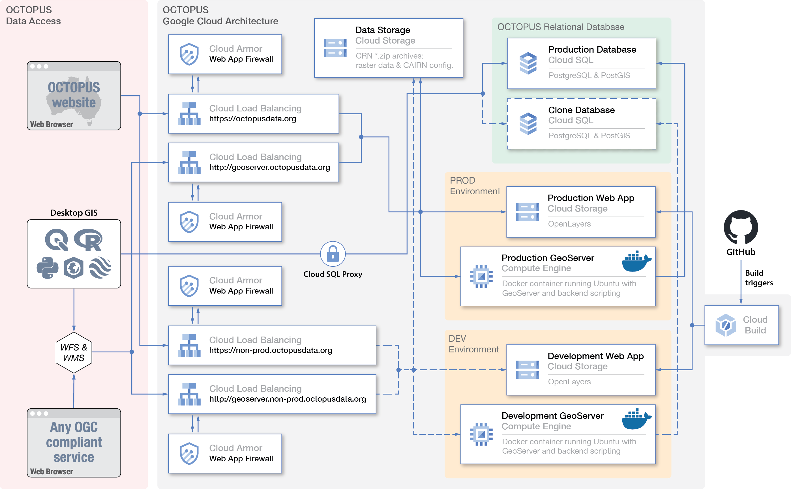

===================
System architecture
===================

.. note::

   The following section is a insignificantly modified copy of Section 2 from `Codilean et al. 2022 <https://doi.org/10.5194/essd-14-3695-2022>`_

The software architecture behind OCTOPUS v.2 is illustrated in Fig. Sys1. Both software and data are deployed on the Google Cloud Platform (GCP) and follow a modular set-up aimed at optimal leveraging of cloud services available within the GCP. Although migration of the OCTOPUS platform to a cloud-hosted infrastructure such as the GCP adds complexity to the system architecture, Google Cloud offers extensive infrastructure and software solutions which are constantly updated with the latest technologies and architectures. This constant evolution ensures that any future work and redesigns of the OCTOPUS platform have access to best-in-class solutions. Further, the OCTOPUS platform is completely reproducible with access to a GCP environment, as the source code contains the entire project and required documentation, including infrastructure definitions, application definitions, and deployment steps.

**Fig. Sys1** Schematic of the OCTOPUS v.2 Google Cloud Platform (GCP) set-up. See the text for more details.

Most components of OCTOPUS v.2 run natively on the GCP apart from GeoServer and Tomcat, which are deployed within a Google Compute Engine using a single bespoke Docker container (https://www.docker.com, last access: 1 July 2022). Tabular data as well as the point and polygon geometries associated with each observation (see below) are stored in a PostgreSQL/PostGIS (https://postgis.net, last access: 1 July 2022) relational database running in Cloud SQL. The latter is a SaaS (Software as a Service) meaning that installation, set-up, and running activities of the database are automatically managed by the GCP, decreasing maintenance overhead and providing a monthly uptime/availability of 99.95 %. Raster data and all CAIRN [#]_ input and output files are stored separately within a Cloud Storage bucket in .zip archives. Unlike the first version of OCTOPUS (`Codilean et al., 2018 <https://doi.org/10.5194/essd-10-2123-2018>`_), the .zip archives in OCTOPUS v.2 no longer include the tabular and vector data that are now hosted in the PostgreSQL/PostGIS relational database. Thus, we avoid duplication and make future maintenance of the data more straightforward. The relational database is linked to a GeoServer instance (Fig. Sys1). GeoServer (http://geoserver.org, last access: 1 July 2022) implements a range of OGC data-sharing standards, including the widely used Web Feature Service (WFS) and the Web Map Service (WMS) standards that allow, in addition to connections from a web browser, direct connections to the database from a variety of desktop geographic information system (GIS) applications, including ArcGIS and QGIS (via WFS; see below) and Google Earth (via WMS). GeoServer exports data to various formats, including GML, JSON, Google Earth KML and KMZ, and Esri shapefile. GeoServer (along with Tomcat) is hosted in a Google Compute Engine, an IaaS (Infrastructure as a Service) that allows for a virtualised environment to be run on Google hardware. Geoserver and Tomcat currently exist as a single bespoke Docker container due to limitations of the deployed Geoserver and Tomcat versions that cannot run with separate runtimes. More recent Geoserver and Tomcat versions, however, exist as standard Docker containers that can be run independently aligned with a microservice architecture. Utilising these dockerised versions would permit the applications to be run on managed server-less platforms such as Google Cloud Run, allowing modular horizontal scaling. Further, Tomcat's Common Gateway Interface (CGI) that provides functionality to the OCTOPUS frontend, such as downloading files and retrieving study bounding boxes, could also be separated into independent resources that run on Google Cloud Functions and allow for near-infinite horizontal scalability to meet any fluctuations in traffic volume. Next, the OCTOPUS web frontend is deployed in a Cloud Storage bucket and uses the OpenLayers (https://openlayers.org, last access: 1 July 2022) JavaScript library to display the geospatial data served by the GeoServer instance in a web browser (Fig. Sys1). Finally Cloud Load Balancing is used to distribute traffic and to separate connections to the web interface from those directed to GeoServer directly via WFS/WMS from third-party applications.

.. rubric:: Footnotes

.. [#] `Catchment-Averaged denudatIon Rates from cosmogenic Nuclides: CAIRN <https://doi.org/10.5194/esurf-4-655-2016>`_