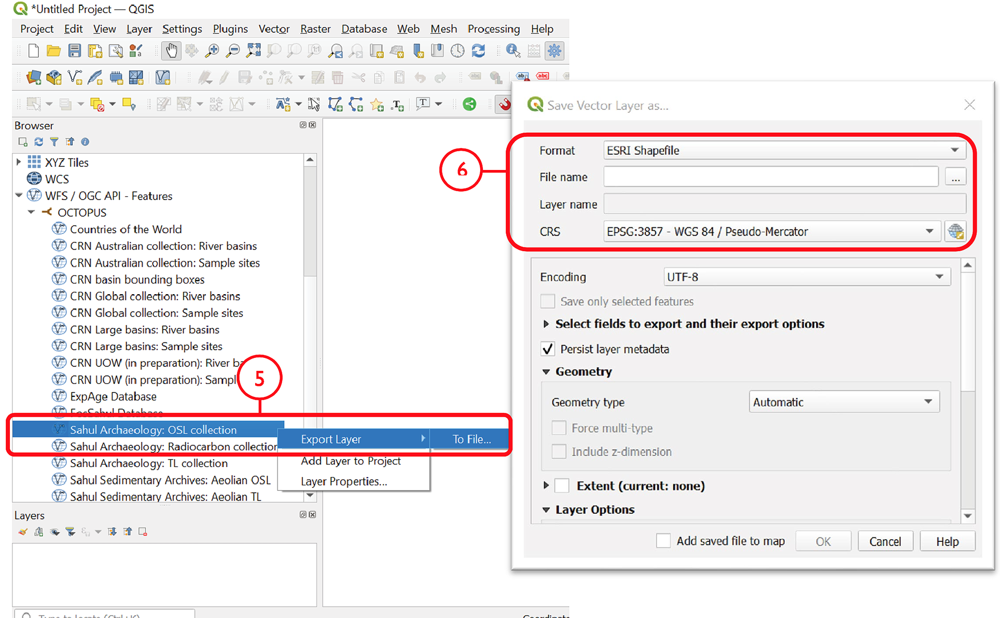

===========
Data access
===========
OCTOPUS data can be viewed and exported through a bespoke web interface or accessed directly. For the latter, OCTOPUS database provides web feature service (WFS) allowing users to access database content via third party software such as Geographic Information Systems (GIS), or R language. OCTOPUS data is served by GeoServer [#]_, an open server solution for sharing geospatial data. Unless data from OCTOPUS is explicitly downloaded and locally stored by the user, it will remain cloud-borne, so the user will not have to care about data storage and being up-to-date.

Web interface
-------------

Layers
~~~~~~
The Layers menu allows you to select data to display, organized by collection. Select tick boxes to view data on the display map.

Filter
~~~~~~
The Filter menu allows you to apply filters to data. You must select at least one dataset to view before you can apply filters, and filters are applied to each data collection individually. In the Filter menu, you can download your filter configuration as a .JSON file and import them.

Export Data
~~~~~~~~~~~
The Export Data menu allows you to download data, unfiltered or filtered by any rules applied in the Filter menu to that dataset. Data may be exported in the following formats: Geography Markup Language (GML) version 2 and 3, ESRI Shapefile, JavaScript Object Notation (JSON), Google Earth KML and KMZ. You will be prompted to provide an intended use of data prior to download.

.. note::

   Exported data in the KML and KMZ formats are geographically restricted to the region displayed on screen at the time of export. Zoom in or out prior to export to capture your region of interest. All other export formats include the complete geographic extent of selected data.

Download Collection
~~~~~~~~~~~~~~~~~~~
The Download Collection menu allows you to request a download of packaged data from the CRN collection. One or more sub-collections from the CRN collection must first be selected in the Layers menu. Hold Ctrl (or Command on Mac) while clicking and dragging to select a region of interest. You will be prompted within the Download Collection menu to provide a name, email address and intended use of data, and tick boxes for data within your selected region.

Setting
~~~~~~~
The Settings menu allows you to change the displayed base map, enable case- sensitivity for filters, and control clustering of data.

Data Display
~~~~~~~~~~~~
Collection data are displayed on a map (see the Settings menu to change base maps) and default to displaying in clusters. Data circles are colour-coded by collection (e.g. Sahul Archaeology: Radiocarbon collection is orange) and show numbers indicating the count of age determinations represented by that circle. The size of circle clusters is also scaled by the number of age determinations it represents. Clicking on a data circle creates a pop-up containing a subset of summary information about the age determinations it represents. Clicking once anywhere in the window outside of the pop-up will close it.

.. note::

   OCTOPUS web interface does not display full data records. To download full data, use the Export Data menu.
   
.. note::

   SahulArch and FosSahul data points are randomly obfuscated within 25km.

Example use cases
~~~~~~~~~~~~~~~~~

Use case #1
^^^^^^^^^^^
In this example, we will prepare a map of Australian archaeological radiocarbon ages >10,000 BP with a monochrome map and no data clustering.

1. Navigate to the Layers menu
2. Select ‘Radiocarbon collection’ under the ‘Sahul Archaeology’ subheading (note: there is no need to deselect/untick CRN or Sahul Sedimentary Archives)
3. Navigate to the Filter menu
4. Select the ‘Sahul Archaeology: Radiocarbon collection’ drop-down menu
5. Choose ‘Age (BP)’ from the drop-down menu
6. Click Add Rule
7. Select ‘>’ (greater than) from the drop-down menu
8. Type ’10000’ in the text box
9. Click anywhere outside of the text box to confirm
10. Navigate to the Settings menu
11. Change the base map to Maptiler Positron
12. Turn off the clustering option. You can now use Print Screen or a screen capture tool to save the map as an image

Use case #2
^^^^^^^^^^^
In this example, we will generate a Shapefile of Australian fluvial OSL dates from publications newer than the year 2000, derived from sediments or dating quartz, collected by core or by auger.
1. Navigate to the Layers menu
2. Select ‘OSL collection’ under ‘Fluvial deposits’ under ‘Sahul Sedimentary Archives’ (note: there is no need to deselect/untick CRN or Sahul Archaeology)
3. Navigate to the Filters menu
4. Select the ‘Sahul Sedimentary Archives: Fluvial
deposits: OSL collection’ drop-down menu. Leave ‘Match Type’ set to ‘All’ (default)
5. Choose ‘Year’ from the drop-down menu
6. Click ‘Add Rule’
7. Select ‘>’ (greater than) from the drop-down menu
8. Type ‘2000’ in the text box
9. Click anywhere outside of the text box to confirm
10. Click ‘Add Group’ above this filter
11. In the new group that appears below your first filter, change the ‘Match Type’ to ‘Any’
12. Select ‘Type of material used’ from the drop-down list
13. Click ‘Add Rule’
14. Select ‘Sediment’ from the drop-down menu under ‘Type of material used’
15. Select ‘Type of mineral used’ from the drop-down list
16. Click the ‘Add Rule’ button again
17. Select ‘Quartz’ from the drop-down menu under ‘Type of material used’
18. Within the Filter menu, scroll back up to the top of the menu and click ‘Add Group’
19. Scroll down to your new group and change ‘Match Type’ to ‘Any’
20. Select ‘Sample collection method’ from the drop-down menu
21. Click ‘Add Rule’
22. Leave the default option of ‘Auger’ for ‘Sample collection method’
23. Click ‘Add Rule’
24. Select ‘Core’ from the second drop-down menu
25. Navigate to the Export Data menu
26. Select ‘Sahul Sedimentary Archives: Fluvial deposits: OSL collection’ from the first drop-down menu
27. Leave ‘Shapefile’ (default) in the second drop-down menu
28. Choose your intended use of the data from the third drop-down menu (e.g. ‘Research (other)’)
29. Click ‘Export Layer’

Use case #3
^^^^^^^^^^^
In this example, we will generate KML files of archaeological, fossil, and sediment age determinations from Cape York Peninsula (IBRA bioregion [#]_) between 1000 and 8000 years old.
1. Navigate to the Layers menu
2. Select (by tick boxes) all sub-collections in the Sahul Sedimentary Archives and Sahul Archaeology collections and select the FosSahul Database (note: there is no need to deselect/untick CRN)
3. Navigate to the Filter menu
4. Click the Sahul Sedimentary Archives: Fluvial deposits: OSL collection drop-down menu
5. Select ‘OSL age (ka)’ from the second drop-down list
6. Click ‘Add Rule’
7. In the ‘OSL age (ka)’ filter section, select ‘<=’ (lesser than or equal to) and type 8
8. Click anywhere outside of the text box to confirm
9. Click ‘Add Rule’ again
10. In the second ‘OSL age (ka)’ filter section, select ‘>=’ (greater than or equal to) and type 1
11. Select ‘IBRA-7 bio-region name’ from the first filter drop-down menu
12. Click ‘Add Rule’
13. In the ‘IBRA-7 bio-region name’ filter section, select ‘Cape York Peninsula’
14. Click outside the text box to confirm
15. Repeat steps 4 to 11 for all remaining data collections (note that some will specify ‘TL age (ka)’ instead of ‘OSL age (ka’) except for Sahul Archaeology: Radiocarbon collection as SahulArch radiocarbon ages are listed in years BP not thousand years (ka)
16. For Sahul Archaeology: Radiocarbon collection, select ‘Age (BP)’
17. Click ‘Add Rule’
18. Select ‘<=’ (lesser than or equal to) and type ’8000’
19. Click ‘Add Rule’
20. Select ‘>=’ (greater than or equal to) and type ’1000’
21. Select ‘IBRA-7 bio-region name’ from the first filter drop-down menu
22. Click ‘Add Rule’
23. In the ‘IBRA-7 bio-region name’ filter section, select ‘Cape York Peninsula’
24. Click outside the text box to confirm
25. Navigate to the Export Data menu
26. Select ‘Sahul Sedimentary Archives: Fluvial deposits: OSL collection’ from the first drop-down menu, ‘KML’ from the second drop- down menu, and intended research purpose (e.g. ‘Research (other)’) from the third drop-down menu
27. Click Export Layer and save file
28. Repeat steps 26-27 for each data collection

Web Feature Service
-------------------
This user guide and brief demonstration of capabilities outlines how to use WFS through third-party software, specifically `QGIS <https://qgis.org>`__ and/or `R software <https://www.r-project.org/>`__ environment as these software solutions are free, open-source and highly versatile.

WFS in a nutshell
~~~~~~~~~~~~~~~~~
| Geospatial and location information development and standardisation globally is overseen by the Open Geospatial Consortium (OGC) [#]_. Web Feature Service (WFS) is an OGC interface standard that enables platform independent requests for spatial features across the internet. This is accomplished by Geography Markup Language (GML), an XML derivative. Unlike for WMS (Web Map Service), where immutable map tiles are returned, WFS vector entities can be queried, altered, and spatially analysed.
| WFS functionality knows three basal operations - ``GetCapabilities``, ``DescribeFeatureType``, and ``GetFeature``. Calling *GetCapabilities* will generate a standardised, human readable meta-dataset that describes a WFS service and its functionality. *DescribeFeatureType* produces an overview of supported feature types, and *GetFeature* fetches features including their geometry and attribite values, i.e, variable fields.

WFS data access via QGIS
~~~~~~~~~~~~~~~~~~~~~~~~
1. After opening QGIS, start a new project: *Project > New*
2. In the Browser pane, select *WFS/OGC API Features > New Connection…*

.. image:: ./img/wfsQGIS_fig1.png
   :width: 750px

3. Name the new connection (e.g., ‘OCTOPUS’) and insert the link http://geoserver.octopusdata.org/geoserver/wfs in the URL field. Click OK. All available OCTOPUS collections will appear in the Browser pane once a connection is established

.. image:: ./img/wfsQGIS_fig2.png
   :width: 600px

4. To add a collection of interest, right click on that collection in the Browser pane and select *Add Layer to Project*. The collection will appear in the Layers pane. Alternatively, click + drag the layer of interest into the Layers pane
5. To locally store a collection, select *Export Layer > To File*
6. Select a file format and specify a file name and save location via the ‘…’ button. Select the coordinate reference system (CRS) of choice; OCTOPUS v.2 collections use EPSG: 3857 (WGS84 Pseudo-Mercator)

7. To add a saved shapefile to the project, navigate to the *main menu > Layer > Add Layer > Add Vector Layer*. Selecting the .shp, .dbf or .shx file (of the six separate files that constitute the shapefile) will open the collection in the Layers pane

Excursus. Obtaining obfuscated geographical coordinates in QGIS
^^^^^^^^^^^^^^^^^^^^^^^^^^^^^^^^^^^^^^^^^^^^^^^^^^^^^^^^^^^^^^^
Sites belonging to OCTOPUS data collections SahulArch and FosSahul are potentially culturally sensitive. As a result, coordinates have been obfuscated for these collections using a 25-km radius randomising algorithm. These former point data are represented by polygons now and coordinates are not pushed with the attribute table, or the .csv file if the collection is exported. Follow these steps to obtain obfuscated coordinates (keeping in mind the ≥ 25 km uncertainty) for these collections by calculating polygon centroid points:

1. Navigate to the *main menu > Vector > Geometry Tools > Centroids*\ …
2. Select the collection of interest as the Input Layer, and click Run

.. image:: ./img/wfsQGIS_fig4.png
   :width: 750px

3. To save coordinates, go to the Processing Toolbox pane and select *Vector table > Add X/Y fields to layer*
4. Input Layer should appear as the generated centroids, and the coordinate system must be kept as default EPSG: 4326 – WGS84
5. Click Run. This will generate a new layer, Added Fields, in the Layers pane. In the Attribute Table, fields for ‘x’ (longitude) and
   ‘y’ (latitude) will appear at the end of the table with corresponding coordinates for each point feature

.. image:: ./img/wfsQGIS_fig5.png
   :width: 750px

WFS data access via R/RStudio
~~~~~~~~~~~~~~~~~~~~~~~~~~~~
The below demo R script fetches, via WFS, spatial layers including rich attribute data from OCTOPUS database and generates a scatter plot and an interactive map representation, respectively.

.. note::

   The script requires the below packages. If not installed on your machine yet, run

.. code-block:: r

    install.packages(c("sf","httr","tidyverse","ows4R","viridis", "mapview", dependencies = TRUE))

and you’ll be all set up.

First we’re going to load the required packages

.. code-block:: r

    library(sf) # Simple features support (sf = standardized way to encode spatial vector data)
    library(httr) # Generic web-service package for working with HTTP
    library(tidyverse) # Workhorse collection of R packages for data sciences
    library(ows4R) # Interface for OGC web-services incl. WFS
    library(viridis) # Predefined colorblind-friendly color scales for R

OK, we’re ready to go now. In the following we store the OCTOPUS WFS URL in an object. Then, using the latter, we establish a connection to OCTOPUS database.

.. code-block:: r

    OCTOPUSdata <- "http://geoserver.octopusdata.org/geoserver/wfs" # store url in object
    OCTOPUSdata_client <- WFSClient$new(OCTOPUSdata, serviceVersion = "2.0.0") # connection to db
 
Let’s see what is there, i.e. show all available layer names and titles
 
.. code-block:: r

    OCTOPUSdata_client$getFeatureTypes(pretty = TRUE) # show available layers and titles
    
The above WFS request should yield the following overview

.. code-block:: r

                                               name                                      title
    1                    be10-denude:crn_aus_basins    CRN Australian collection: River basins
    2                   be10-denude:crn_aus_outlets    CRN Australian collection: Sample sites
    3                    be10-denude:crn_int_basins        CRN Global collection: River basins
    4                   be10-denude:crn_int_outlets        CRN Global collection: Sample sites
    5                    be10-denude:crn_xxl_basins             CRN Large basins: River basins
    6                   be10-denude:crn_xxl_outlets             CRN Large basins: Sample sites
    7                 be10-denude:crn_inprep_basins     CRN UOW (in preparation): River basins
    8                be10-denude:crn_inprep_outlets     CRN UOW (in preparation): Sample sites
    9                      be10-denude:publications                   CRN basin bounding boxes
    10                            opengeo:countries                     Countries of the World
    11                           be10-denude:expage                            ExpAge Database
    12 be10-denude:fossahul_webmercator_nrand_25000                          FosSahul Database
    13                    be10-denude:sahularch_osl          Sahul Archaeology: OSL collection
    14                    be10-denude:sahularch_c14  Sahul Archaeology: Radiocarbon collection
    15                     be10-denude:sahularch_tl           Sahul Archaeology: TL collection
    16             be10-denude:sahulsed_aeolian_osl    Sahul Sedimentary Archives: Aeolian OSL
    17              be10-denude:sahulsed_aeolian_tl     Sahul Sedimentary Archives: Aeolian TL
    18             be10-denude:sahulsed_fluvial_osl    Sahul Sedimentary Archives: Fluvial OSL
    19              be10-denude:sahulsed_fluvial_tl     Sahul Sedimentary Archives: Fluvial TL
    20          be10-denude:sahulsed_lacustrine_osl Sahul Sedimentary Archives: Lacustrine OSL
    21           be10-denude:sahulsed_lacustrine_tl  Sahul Sedimentary Archives: Lacustrine TL

**That’s basically it.** Talking to the database via WFS takes three short lines of code. Everything below this line does not deal with data access anymore, but with data presentation. [#]_

Example 1. Australian 10Be-derived catchment-averaged denudation rates
^^^^^^^^^^^^^^^^^^^^^^^^^^^^^^^^^^^^^^^^^^^^^^^^^^
In this example we fetch and plot Australian catchment-averaged 10Be denudation rates (i.e., layer *‘be10-denude:crn_aus_basins’* from the above list)

.. code-block:: r

    url <- parse_url(OCTOPUSdata) # parse URL into list
    url$query <- list(service = "wfs",
                      version = "2.0.0",
                      request = "GetFeature",
                      typename = "be10-denude:crn_aus_basins",
                      srsName = "EPSG:900913") # set parameters for url$query

    request <- build_url(url) # build a request URL from 'url' list
    CRN_AUS_basins <- read_sf(request) # read simple features using 'request' URL. Takes few secs...

Now that we have the data available, we define our plot parameters. We want to plot denudation rate ("EBE_MMKYR") over average slope gradient ("SLP_AVE") and call the plot (last line)

.. code-block:: r

    myPlot <- ggplot(CRN_AUS_basins, aes(x=SLP_AVE, y=EBE_MMKYR)) + # plot denudation rate over average slope
    geom_errorbar(aes(ymin=(EBE_MMKYR-EBE_ERR), ymax=(EBE_MMKYR+EBE_ERR)), linewidth=0.3, colour="gray80") + # visualise errors
    geom_point(aes(size=AREA, color=ELEV_AVE), alpha=.5) + # scale pts. to "AREA", colour pts. to "ELEV_AVE"
    scale_color_viridis(option="C", direction = -1) + # use 'viridis' colour scale
    scale_size_continuous(range = c(2, 10)) + # define point size range for better visibility
    xlab("Slope gradient [m km^-1]") + ylab("Denudation rate [mm kyr^-1]") + # define label x and y axes
    ggtitle("Australian 10Be catchment-avg. denudation rates") + # make title
    theme(plot.title = element_text(size = 18, face = "bold")) + # title settings
    labs(size = "Catchment \narea [km^2]", colour = "Average \ncatchment \nelevation [m]") # re-label legend
    myPlot # call plot

|

.. figure:: ./img/AUSdenudation.png
   :alt: AUS 10Be catchment-averaged denudation rates
   :width: 750px
   
   Plot 1. Australian 10Be-derived catchment-averaged denudation rates against average slope gradient

Example 2. Australian sedimentary fluvial OSL ages
^^^^^^^^^^^^^^^^^^^^^^^^^^^^^^^^^^^^^^^^^^^^^^^^^^
For this example we quickly want to display Australian OSL (Optically Stimulated Luminescence) ages on a base map.

.. code-block:: r

    library(mapview) # Provides functions for quick visualisation of spatial data
    mapviewOptions(fgb = FALSE)
    url2 <- parse_url(OCTOPUSdata) # parse URL into list
    url2$query <- list(service = "wfs",
                       version = "2.0.0",
                       request = "GetFeature",
                       typename = "be10-denude:sahulsed_fluvial_osl",
                       srsName = "EPSG:900913") # set parameters for url$query

    request2 <- build_url(url2) # build request URL from 'url' list
    SahulSed.FLV.OSL <- read_sf(request2) # read simple features using 'request' URL. Takes few secs...
    SahulSed.FLV.OSL <- st_set_crs(SahulSed.FLV.OSL, 900913) # Set Coordinate Reference System
    SahulSed.FLV.OSL = st_transform(SahulSed.FLV.OSL,
            crs = "+proj=longlat +datum=WGS84") # Transform geometry to geographic coordinates, WGS84
    mapview(SahulSed.FLV.OSL, xcol = "X_WGS84", ycol = "Y_WGS84",
            zcol = "OSL_AGE", at = seq(0, 350, 50), alpha = .25, # set range (0 to 350 ka) and bins (50 ka)
            alpha.regions = 0.1, legend = TRUE) # Display on map using "mapview" package

|

.. figure:: ./img/AUS_sedflvOSL.png
   :alt: AUS sedimentary fluvial OSL ages
   :width: 750px
   
   Plot 2. Australian sedimentary fluvial OSL ages

**All done!**

.. note::

   Thanks to the very slick 'Mapview' [#]_ functionality, points of the original output map are mouse-over sensitive and can be queried in depth by clicking. Further, the map is scalable and you can choose between a decent selection of base map layers. Try it in R!

.. rubric:: Footnotes

.. [#] `https://www.dcceew.gov.au/environment/land/nrs/science/ibra <https://www.dcceew.gov.au/environment/land/nrs/science/ibra>`_
.. [#] `http://geoserver.octopusdata.org/ <http://geoserver.octopusdata.org/>`_
.. [#] `https://www.ogc.org <https://www.ogc.org>`_
.. [#] A full description of OCTOPUS database and its collections can be found in a dedicated `Earth Systems Science Data <https://doi.org/10.5194/essd-14-3695-2022>`_ publication.
.. [#] `https://r-spatial.github.io/mapview/ <https://r-spatial.github.io/mapview/>`_
